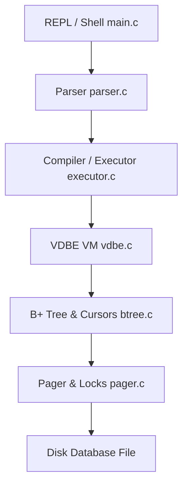

# Database Engine Architecture

This document provides a high-level overview of the architecture of our custom relational database management system (RDBMS), inspired by the design and implementation of SQLite.

---

## System Block Diagram

---

## Core Subsystems

The database engine is built as a layered stack of modules, each with dedicated responsibilities:

### 1. User Interface & REPL (`main.c`)
- Implements the interactive terminal shell.
- Reads user commands, routes SQL queries to the compiler, executes bytecode on the VM, and outputs results.
- Processes dot-commands (e.g., `.schema`, `.exit`).

### 2. Frontend Parser (`parser.c`, `parser.h`)
- Tokenizes incoming SQL statements.
- Parses schema definitions, transactions, indexes, reads (with `WHERE`, `JOIN`, `ORDER BY`, `LIMIT`), inserts, updates, and deletions.
- Maps syntax trees to structured SQL statement descriptors (`Statement`).

### 3. VM Code Generator & Compiler (`executor.c`)
- Compiles the abstract `Statement` representation into a sequential register-based Virtual Database Engine (VDBE) program.
- Allocates registers dynamically and schedules jump/compare bytecode instructions.
- Implements Index-Nested Loop Join planning and Index scan selection.

### 4. Virtual Database Engine / VDBE (`vdbe.c`, `vdbe.h`)
- A register-based virtual machine executing bytecode instructions.
- Maintains VM state: registers (`regs`), open cursors (`cursors`), and a transient sort buffer (`sorter`).
- Executes opcodes such as `OP_OpenRead`, `OP_SeekGE`, `OP_Column`, `OP_ResultRow`, and `OP_SorterSort`.

### 5. B+ Tree & Index Engine (`btree.c`, `btree.h`, `cursor.c`)
- Organizes database data into B+ Trees (for table records) and B-Trees (for secondary indexes).
- Implements variable-length slotted page layouts, leaf node cell ordering, child page splits, and pointer balancing.
- Exposes cursor abstraction for forward scanning and point lookups.

### 6. Pager & Transaction Lock Manager (`pager.c`, `pager.h`)
- Manages reading/writing of physical $4\,\text{KB}$ pages from/to disk.
- Implements an in-memory page cache to minimize disk I/O.
- Coordinates concurrency using a **Five-State Locking Engine** based on file-level advisory locks.
- Guarantees ACID compliance using a Write-Ahead Rollback Journal (`.db-journal`) and automatic recovery on startup.
